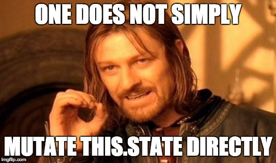

# 0x05. React state

    

## Tasks

- **0. Adding a local state for notifications**

  - [task_0](./task_0/)

- **1. Controlled components and state callback**

  - [task_1](./task_1/)

- **2. Context**

  - [task_2](./task_2/)

- **3. Context consumer & advanced state**

  - [task_3](./task_3/)

- **4. Introduction to react hook**
  - [task_4](./task_4/)
